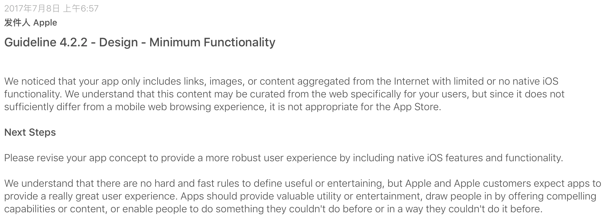
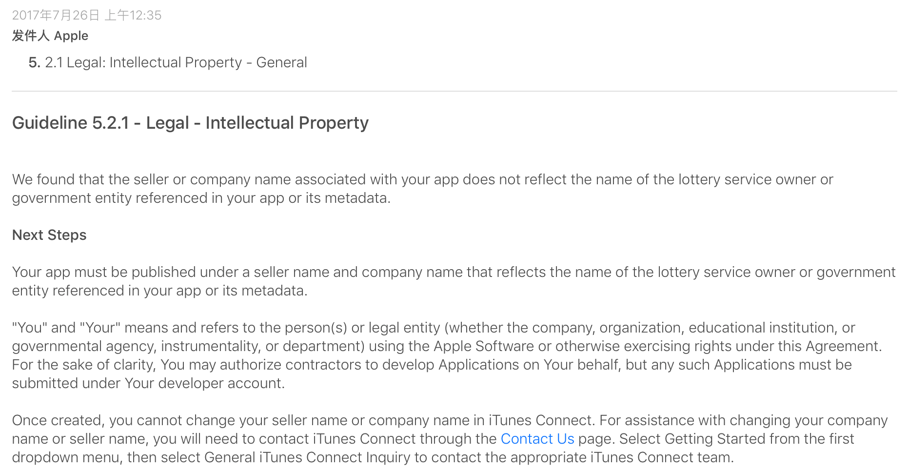
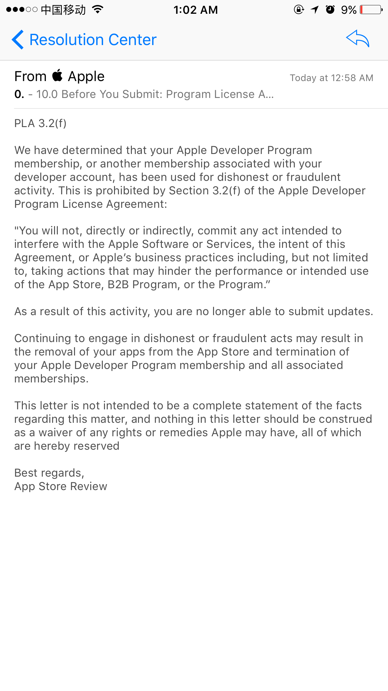

# XYLottery

一款彩票App

下面记录了几次提交被拒的情况，做个记录

### FIRST TIME : 4.2 Minimum Functionality (2017 - 7 - 11)

**Today is the first time I post this binary to Apple,Also it is the first time be reject by Apple! And there is the image below!**

what a fuck !

My app's function is so little, less then the minx functions judged by Apple.

OK, I will try the next time!  

### SECOND TIME : 5.2.1 Legal Intellectual Property (2017 - 7 - 26)

The second time was also failed , and there is the image bellow:

what is the hell！

### THIRD TIME : PLA 3.2（f）(2017 - 7 - 27)

The third time was also failed , and there is the image bellow:

what is the hell！

## Next

tomorrow i will do this again。really。。

明天继续

However so many times I have been rejected by Apple, I know my app realy has some questions, I am not angry with it.  I
have sellected some blogs that also with these problems.
Here are these links:

[IOS 发布被拒 3.2 f : http://www.cnblogs.com/foreverfendou/p/6867574.html](http://www.cnblogs.com/foreverfendou/p/6867574.html) 

[关于苹果审核被拒PLA1.2,ipv6被拒该如何解决
http://www.jianshu.com/p/c1f25e1747e2](http://www.jianshu.com/p/c1f25e1747e2)

[金融类APP常见被拒绝原因分析及解决 : http://www.woshipm.com/operate/746939.html](http://www.woshipm.com/operate/746939.html)

